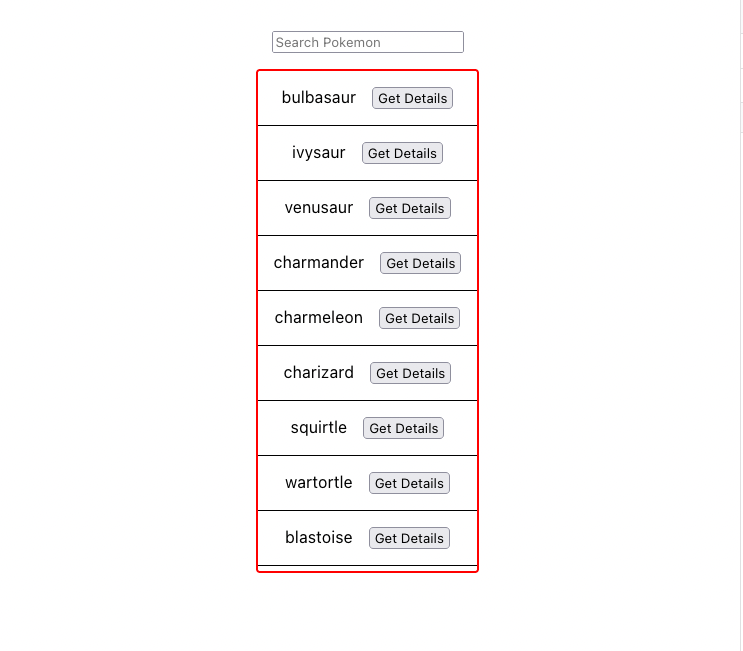

# Givebutter Frontend Take-home

## Overview

Our goal is to fix and enhance a Pokedex application. If you are unfamiliar with the world of Pokemon, here is a brief explanation:

> The Pokedex is an electronic device created and designed to catalog and provide information regarding the various species of Pokemon featured in the Pokemon video game, anime and manga series.
 
[Source](https://pokemon.fandom.com/wiki/Pokedex)
 
Our version of the Pokedex is able to list and search through Pokemon. However, our search is a bit buggy. Additionally, we want to add a feature that shows a selected Pokemon's details like its **type**, **moves**, and **evolution chain**.

Your time is valuable, and we are extremely appreciative of you participating in this assessment. We're looking to gauge your ability to read and edit code, understand instructions, and deliver features, just as you would during your typical day-to-day work. We expect this test to take no more than one to two hours and ask to complete this work within the next two days. Upon submit, we will review and provide feedback to you regardless of our decision to continue the process.

Please update and add code in `App.js` and `index.css` based on the requirements found below. Additionally, we ask you to edit the `readme.md` with answers to a few questions found in the `Follow-up Questions` section also found below.

When you are finished, please upload your completed work to your Github and invite `@gperl27` to view it. **Do not open a PR please.**

## Setup

- This repo was scaffolded using `create-react-app`. As such, this app requires a stable version of `node` to get up and running.
- Clone this repo and run `npm install`.
- To run the app, run `npm start`.
- Please reach out to the Givebutter team if you have any issues with the initial setup or have any problems when running the initial app.

## Requirements

### Search
- Typing in the search input should filter the existing Pokemon list and render only matches found
- Fix any bugs that prevent the search functionality from working correctly
- If there are no results from search, render "No Results Found"
- The search results container should be scrollable
- The UI should match the below mockup

### Details Card
     
- Clicking "Get Details" for any given Pokemon should render a card that has the Pokemon's `name`, `types`, `moves`, and `evolution chain`
- Use the api functions defined in `api.js` to retrieve this data. Adding new endpoints or editing existing ones are out of scope
- The details card should match the below mockup

## Follow-up Questions

Please take some time to answer the following questions. Your answers should go directly in this `readme`.
## **Question**  
- Given more time, what would you suggest for improving the performance of this app?  
  ## **Answer**
  1. Refactoring the api so that we dont have to do multiple query's for the answers
  2. Implement Pagination or Infinite Scrolling. This will reduce the initial load time if the list goes from 150 to 400 pokemon or more
  3. Caching data such as using react query or another caching mechinism. This will reduce netowrk requests for pokemon that have already been fetched before

## **Question**  
- Is there anything you would consider doing if we were to go live with this app?  
  ## **Answer**
 1. **Favorite and Bookmark Pokémon**  
   - Allow users to mark their favorite Pokémon and save them for quick access.  
   - Include a dedicated “Favorites” section to view and manage bookmarked Pokémon.

 2. **Battle Simulator**  
   - Simulate battles between Pokémon, showcasing stats, type matchups, and move effectiveness. I would add sound effects for the pokemon cries here
   - maybe add an AR integration of 3d models of the pokemon 
   

 3. **Pokémon Compare Tool**  
   - Let users compare two Pokémon side-by-side, displaying their stats, types, and moves.  
   - Help the users make great decisions for battles.

## **Question**  
- What was the most challenging aspect of this work for you (if at all)?  
  ## **Answer** 
 1. The most challenging aspect in this work was going through the API and understanding where the data was coming from. Like i did in my code i would re work the api to make it easier to fetch for specific information about a pokemon that will result in fewer queries.
